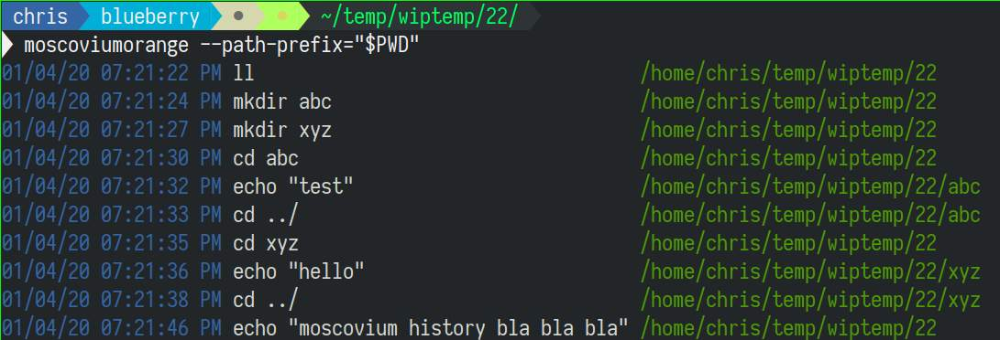

# Use Atuin instead!
I would recommend https://github.com/atuinsh/atuin instead of this project. 

# MoscoviumOrange


A feature full command line history logger/viewer. It logs the command, path and timestamp.

Some examples:

- View history of current directory recursively (it's sub directories)
  ```
  moscoviumorange --path-prefix=$PWD
  ```

- View history of all commands that had "curl" 
  ```
  moscoviumorange --command-contains=curl
  ```

There are options to filter the results by:

- path prefix/suffix/anywhere
- command prefix/suffix/anywhere
- before / after (time)

I've tried to make it disk write efficient by only writing to the filesystem if there are new entries, as well as only writing every n seconds.

## Limitations

- There seems to be a tiny bug where the client won't load the latest records untill the daemon is restarted (I've only seen this happen once).
- There is no lockfile, which makes it easy overwrite your history data by running two instances of the daemon... Yes this happened to me once or twice.
- No support for timezone / localization.

## Installation

### Nix

```
nix-env -i -f https://github.com/chrissound/MoscoviumOrange/archive/master.tar.gz
```

### Others

Probably install cabal / stack and then build it from there.

## Help 
```
moscoviumorange --help  
Usage: moscoviumorange ([--print] [--limit NUMBER] [--json] |
                     [--path-contains STRING] [--path-prefix STRING]
                     [--path-suffix STRING] [--path STRING]
                     [--command-contains STRING] [--command-prefix STRING]
                     [--command-suffix STRING] [--command STRING]
                     [--before timestamp] [--after timestamp] [--limit NUMBER]
                     [--json] | [--daemon])

Available options:
  -h,--help                Show this help text
  --print                  Print records
  --limit NUMBER           limit
  --json                   output as json (should be much faster)
  --path-contains STRING   filter path contains
  --path-prefix STRING     filter path prefix
  --path-suffix STRING     filter path suffix
  --path STRING            path equals
  --command-contains STRING
                           filter command contains
  --command-prefix STRING  filter command prefix
  --command-suffix STRING  filter command equals
  --command STRING         command equals
  --before timestamp       filter records that occurred before time
  --after timestamp        filter records that occurred after time
  --limit NUMBER           limit
  --json                   output as json (should be much faster)
  --daemon                 Run daemon listener

```

## Daemon

Just run `moscoviumorange --daemon`.

With Nixos:

```
let

  moscoviumorange = pkgs.callPackage ??????????????? {};
  in
...
```

```
  systemd.user.services = {
    moscoviumOrange = {
      enable = true;
      description = "MoscoviumOrange terminal history";
      serviceConfig = {
        Type      = "simple";
        ExecStartPre = "${pkgs.coreutils}/bin/mkdir -p %h/.config/moscoviumOrange/pending/";
        ExecStart = "${moscoviumorange}/bin/moscoviumorange --daemon";
        Restart   = "always";
        RestartSec   = 1;
      };
      wantedBy = [ "default.target" ];
    };
  };
```

### Configure with ZSH

Requires: jq + BSD netcat

```
function printc () {
  # (nohup ~/ScriptsVcs/addEntryToMoscoviumOrange.sh "$1" &) > /dev/null 2>&1 # 
  if [ -S ~/.config/moscoviumOrange/monitor.soc ]; then
      $(jq -n --arg command "$1" --arg path "$PWD" '{"command":$command, "path":$path}' | "$(echo 'readlink -f $(which nc)' | nix run nixpkgs.netcat)" -N -U ~/.config/moscoviumOrange/monitor.soc &)
  else
      echo "Failed to log command to moscoviumorange" > /dev/stderr
  fi
}

add-zsh-hook preexec printc
```
